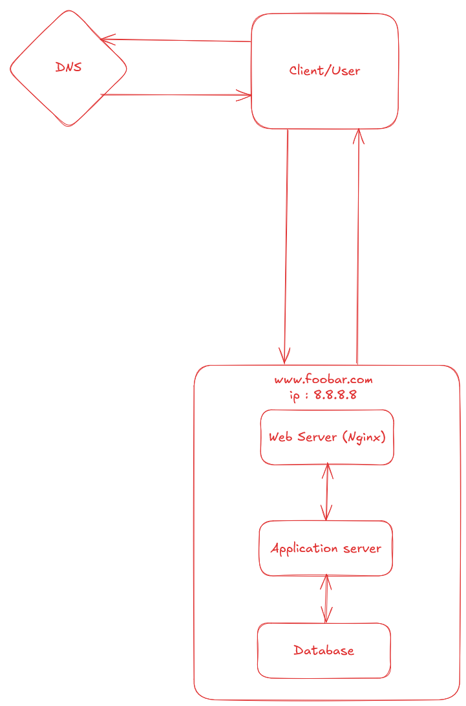

# Simple Web Stack

## What is a server?

A server is a computer or system that provides resources, data, services, or programs to other computers (called clients) over a network. Servers are designed to process requests and deliver data to other (client) computers.

## What is the role of the domain name?

A domain name (like foobar.com) is a human-readable address used to access websites. It maps to an IP address (like 192.168.1.1) of the server hosting the site, making it easier for users to reach websites without remembering complex numerical IP addresses.

## What type of DNS record is www in www.foobar.com?

In www.foobar.com, www is typically a CNAME record (Canonical Name), which maps www.foobar.com to another domain name like foobar.com. Sometimes it can be an A record if it directly maps to an IP address.

## What is the role of the web server?

A web server handles HTTP requests from clients (like web browsers) and delivers web pages (HTML, CSS, images, etc.). Examples of web servers include Apache, Nginx, and Microsoft IIS.

## What is the role of the application server?

An application server runs the business logic of the web application. It processes dynamic content (like user logins, database queries, or custom functions). It communicates with both the web server and the database. Examples: Node.js, Django, Spring Boot, etc.

## What is the role of the database?

A database stores, organizes, and retrieves structured data for the application. It holds user information, content, transactions, and more. Common databases include MySQL, PostgreSQL, MongoDB, and Oracle.

## What is the server using to communicate with the computer of the user requesting the website?

The server communicates with the user's computer using the HTTP or HTTPS protocol over the TCP/IP network stack. HTTPS is the secure version, encrypting data with TLS (Transport Layer Security).

## What the issues are with this infrastructure:

1. SPOF : If you have only one web server, one database, or one load balancer, then any single failure will bring down the entire application.

2. Downtime When Maintenance Is Needed : 
  - Deploy new code.
  - Update dependencies.
  - Restart services.

3. Cannot Scale with High Traffic :
A single server has limited resources (CPU, RAM, bandwidth). If traffic increases suddenly:
  - The server may become slow or unresponsive.
  - Requests may be dropped if limits are exceeded.
