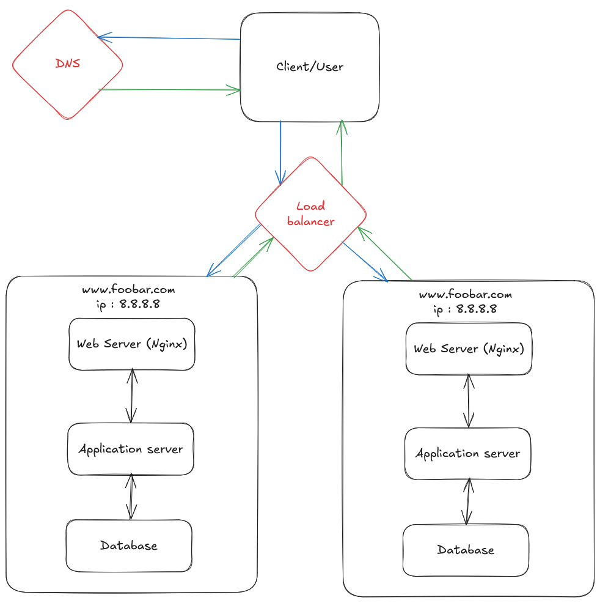

# Distributed Web Infrastructure

## Why add a load balancer?

A load balancer is used to distribute traffic between multiple servers.
This helps make sure no single server gets too much traffic.

## What algorithm does the load balancer use?

A common algorithm is Round Robin.
It sends each new visitor to the next server in the list.
For example: visitor 1 goes to server A, visitor 2 to server B, visitor 3 to server C, and then back to A.

## Active-Active or Active-Passive? What is the difference?

  - Active-Active:
    All servers are working at the same time.
    This gives better performance and handles more traffic.

  - Active-Passive:
    One server is active, and the others are on standby.
    A standby server takes over only if the active one fails.

Most web systems use Active-Active for better speed and availability.

## Why add multiple web or application servers?

We add more servers to:
  - Handle more users,
  - Avoid downtime if one server fails,
  - Deploy updates without stopping the whole site.

## How does a Primary-Replica (Master-Slave) database cluster work?

This setup has one main database and one or more copies.
  - The Primary database handles all changes (like adding or updating data).
  - The Replicas are copies used only for reading data.
  - They stay up to date with the Primary.

## What is the difference between the Primary and Replica from the application’s point of view?
From the application's point of view, the Primary database handles all write operations (like insert and update), while the Replica databases are read-only. The application sends writes to the Primary, and it can read from the Replicas to reduce the load on the Primary and improve performance.
