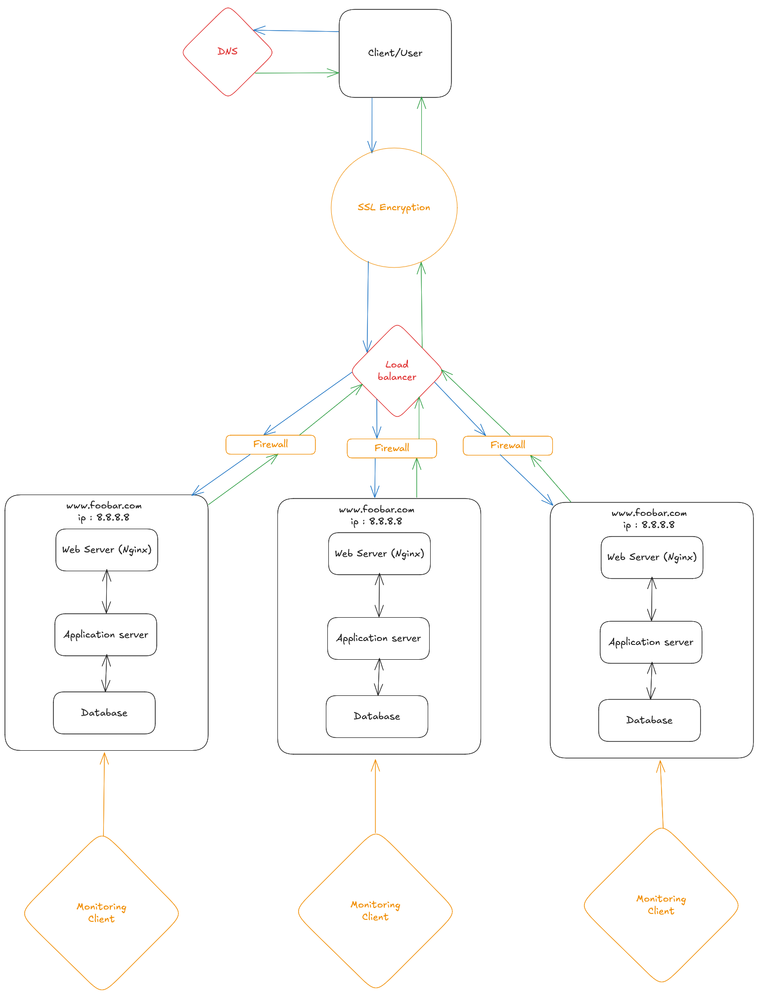

# Secured and monitored web infrastructure 

## Why each new element is added

  - Load balancer: It splits user traffic between servers. This avoids overload and makes the site faster.

  - More web servers: Adding servers helps handle more users and keeps the site working if one server goes down.

  - Database replicas: These help with reading data faster and reduce the load on the main database.

  - Firewall: It protects your servers by blocking unwanted or dangerous traffic.

  - Monitoring: It checks if your system is healthy and working well.

  - HTTPS: It keeps the connection between the user and your server safe by using encryption.

## What firewalls are for

A firewall is used to block unwanted traffic and allow only safe connections.
It helps protect your servers from hackers, viruses, and other threats.

## Why traffic is served over HTTPS

HTTPS encrypts the data between the user and the server.
This means no one can see or change the data while it is being sent.
It also shows users that your site is safe and trusted.

## What monitoring is used for

Monitoring helps you:
  - Check if your servers are running
  - Watch system performance (CPU, memory, etc.)
  - Get alerts if something breaks
  - Plan for growth by looking at traffic patterns

## How the monitoring tool collects data

The monitoring tool can collect data in a few ways:
  - It can run an agent on the server that sends data.
  - It can read logs and system stats.
  - It can scrape a URL that shows metrics.
  - It sends this data to a dashboard where you can see everything.

## How to monitor QPS (Queries Per Second) on your web server

To monitor how many requests your server gets per second:
  - Expose metrics on your web server (like total number of requests).
  - Use a tool like Prometheus to read those metrics.
  - QPS is calculated by checking how much the request count increases over time.
      - Example: If the counter goes from 1000 to 1100 in 10 seconds, the QPS is 10.
  - You can set alerts if the QPS is too high or too low.
