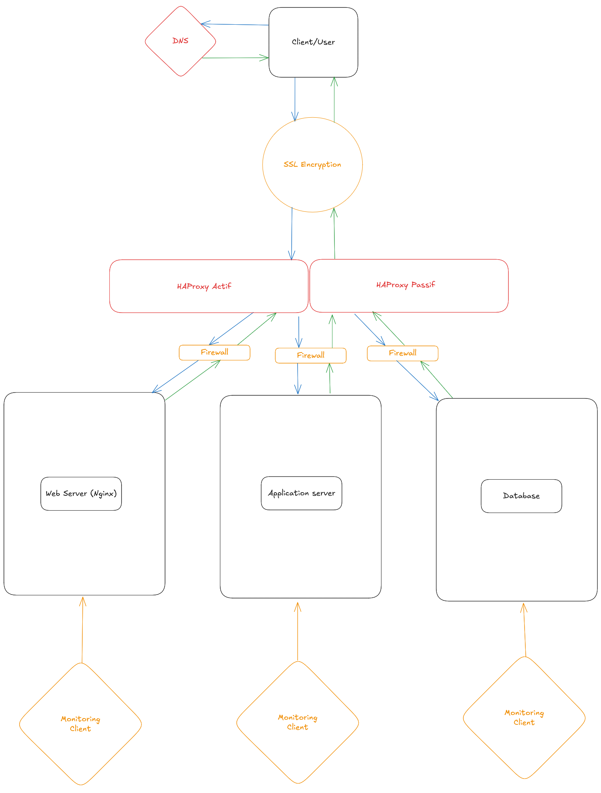

## Web Infrastructure – Components and Justifications

### 1. **Load Balancer (HAProxy in active/passive cluster)**
To distribute incoming traffic across backend servers and ensure high availability in case one load balancer fails.

### 2. **Web Server (NGINX)**
To serve static files and handle HTTPS connections efficiently before forwarding requests to the application server.

### 3. **Application Server**
To run business logic and dynamic content separately from the web server for better scalability and maintainability.

### 4. **Database Server (MySQL)**
To securely store and manage application data independently of other components.

### 5. **Floating IP (Virtual IP)**
To provide a single public IP shared between both HAProxy servers, enabling automatic failover.

### 6. **HAProxy Cluster Configuration (with Keepalived)**
To monitor the health of the active load balancer and switch to the passive one automatically in case of failure.
